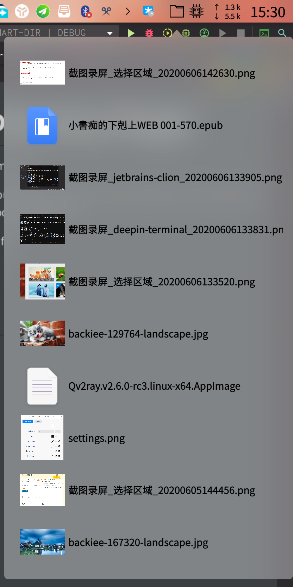
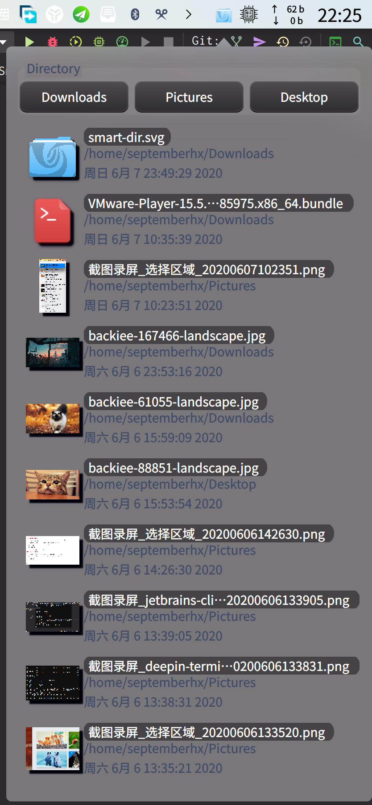
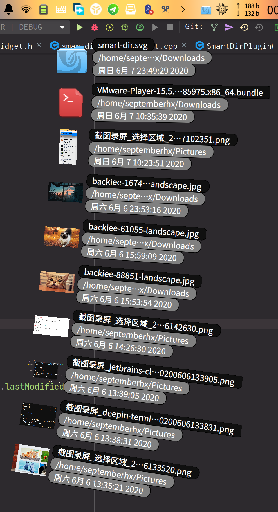

# DDE Smart Directory Dock Plugin for Deepin

Support V20 & V15.11

Inspired by Smart Folder on macOS.

You can set a list of folders you want to watch, and this plugin can show the file list in this files ordered by Modification time.

* Left double click to open file
* drag & move support
* right click to open folder
* quick folder list

## Screenshot

 
 

> fan style is hardcoded so it is coded for panel.

## How to install

Download the release file and put the `.so` file to the plugin path.
